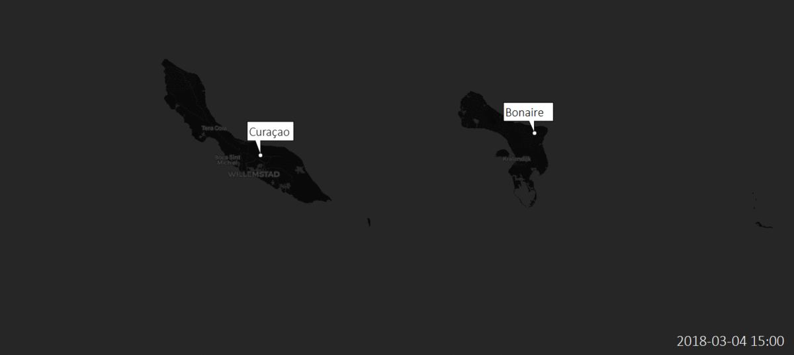

# Mapping Sargassum on beach and coastal waters of Bonaire with Sentinel-2 imagery  - Master thesis

<p align="center">
  
</p>

## Abstract
This research investigated the effectiveness and limitations of Sentinel-2 images for mapping Sargassum on the open sea, the coastal waters and the east coast of Bonaire. This research also evaluated the potential of Sentinel-2 images for mapping the seagrass distribution in the shallow waters of Lac Bay in relation to the possible impact of Sargassum. Sargassum and seagrass distribution maps are important for coastal managers to locate the most impacted sites and to design suitable measures.

Research questions/ objectives:
1. To what extent can Sargassum patches be classified on the coast and coastal waters of Bonaire using Sentinel-2 imagery? 
2. To what extent can floating Sargassum patches be classified on open sea using Sentinel-2 imagery? 
3. Can the impact of Sargassum on seagrass distribution in Lac Bay be mapped with Sentinel-2?

## Repository content

<b>Python</b>  
* Contains all Python scripts used in the Jupyter Notebooks
	
<b>data</b>  
*  Contains all data and models used for analyses in Jupyter Notebook

<b>[00_download_preprocess_sentinel2.ipynb](https://github.com/octo-willy/Sargassum-Sensing/blob/master/00_download_preprocess_sentinel2.ipynb "00_download_preprocess_sentinel2.ipynb")</b>  
*  Notebook for downloading and pre-processing Sentinel-2 images	

<b>[01_sargassum_detection_coast.ipynb](https://github.com/octo-willy/Sargassum-Sensing/blob/master/01_sargassum_detection_coast.ipynb "01_sargassum_detection_coast.ipynb")</b>  
*  Notebook pertains to RQ 1
	
<b>[02_sargassum_detection_sea.ipynb](https://github.com/octo-willy/Sargassum-Sensing/blob/master/02_sargassum_detection_sea.ipynb "02_sargassum_detection_sea.ipynb")</b>  
*  Notebook pertains to RQ 2

<b>[03_seagrass_distribution_lacbay.ipynb](https://github.com/octo-willy/Sargassum-Sensing/blob/master/03_seagrass_distribution_lacbay.ipynb "03_seagrass_distribution_lacbay.ipynb")</b>  
*  Notebook pertains to RQ 3

<b>[xx_sargassum_sensing_demo.ipynb](https://github.com/octo-willy/Sargassum-Sensing/blob/master/xx_sargassum_sensing_demo.ipynb "xx_sargassum_sensing_demo.ipynb")</b>  
*  Notebook demonstrating Sargassum detection and forecasting in open sea

## Instructions
    
1. Clone or download repository
```shell 
> git clone git@github.com:octo-willy/Sargassum-Sensing.git
```
2. Install environment
```shell 
> conda env create -f environment.yml
```
3. Activate environment
```shell 
> activate sargassum
```
4. CD to repository and run notebook</b>
```shell 
> cd path_cloned_repository && jupyter notebook
```